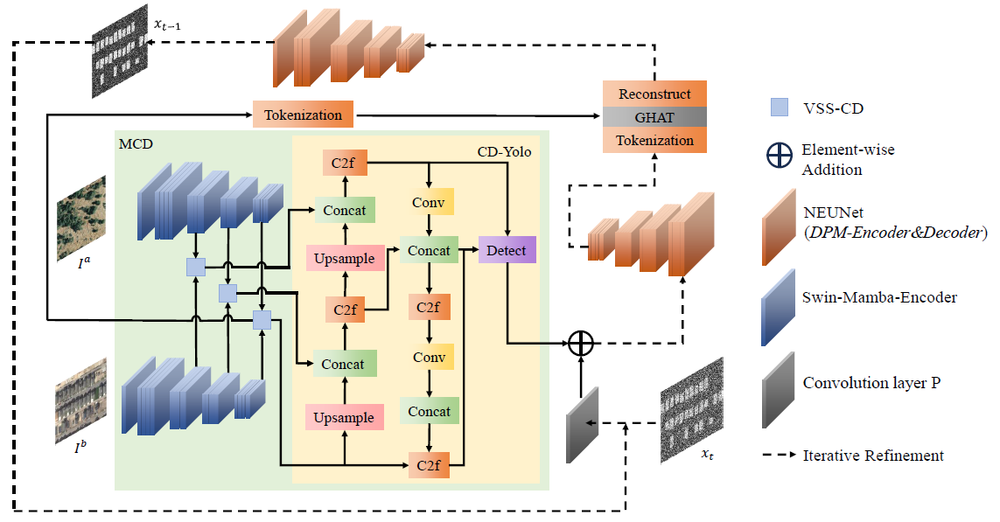
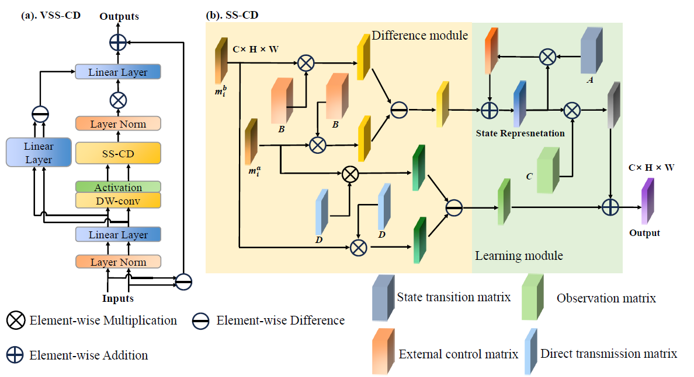
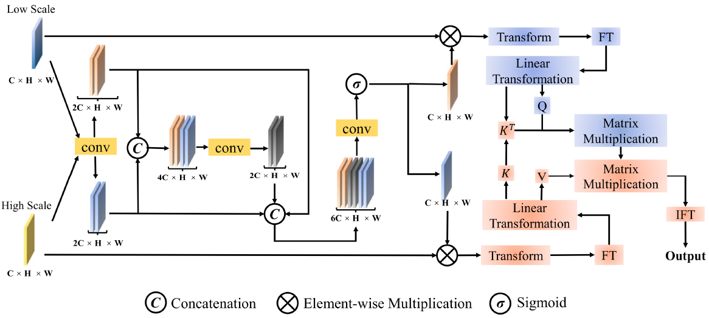
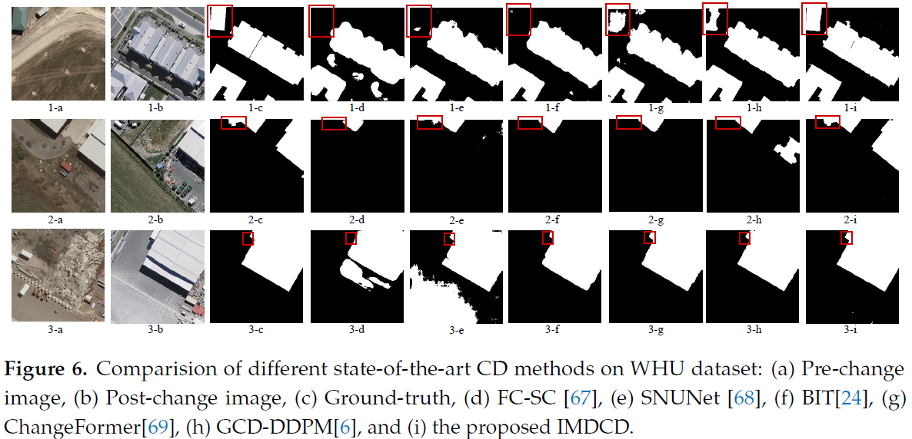

# M-GDCD: Mamba Conditional Generative Diffusion Change Detection Model for Remote Sensing
### Guanchong Niu, Feixiang Liu, Zhuo Zhang, Peipei Zhu, Liang Mao, Yihan Wen†, and Qiguang Miao
#### Xidian University，China
## Our code will be presented in October 2024

### [Paper](https://www.google.com)
### [Code](https://github.com/LiuFxxx/T-GDCD)
## Network Architecture

### The Variable State Space CD (VSS-CD) we proposed

### The Global Hybrid Attention Transformer (GHAT) we proposed

## Quantitative & Qualitative Results on CDD, WHU, LEVIR and OSCD




##  Usage
### Requirements
```
Python 3.8.0
pytorch 1.10.1
torchvision 0.11.2
einops  0.3.2
```
Please see ```requirements.txt``` for all the other requirements.
### Installation
Clone this repo:
```
git clone https://github.com/LiuFxxx/M-GDCD.git
```
### Setting up conda environment:
Create a virtual ```conda``` environment named ```MGDCD``` with the following command:
```
conda create --name MGDCD --file requirements.txt
conda activate MGDCD
```
